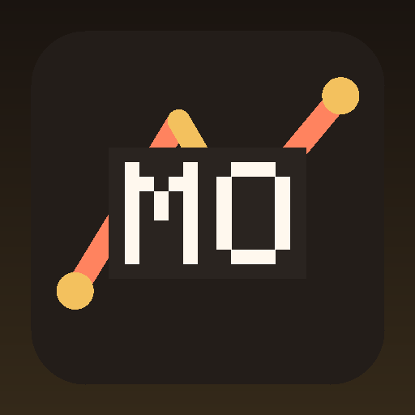

<p align="center"></p>

# Mousing

**A Place Worth Coming Back To.**

A restaurant and dining brand for menus, reservations, locations, events, catering, and hospitality storytelling.

> **A dining experience that connects appetite, atmosphere, booking, and practical guest information.**

---

## What this system is

Mousing is generated as a **dining brand** — not a one-page brochure. The public site, brand assets, support surfaces, and GitHub documentation share one visual and content direction.

### Focus for this build

A restaurant and dining brand for menus, reservations, locations, events, catering, and hospitality storytelling.

## Core Capabilities

- **Menu** — Menu is treated as part of the complete Mousing experience — designed to simplify the system while keeping the experience clear, useful, and maintainable.
- **Reservations** — Reservations is treated as part of the complete Mousing experience — designed to connect the system while keeping the experience clear, useful, and maintainable.
- **Private Dining** — Private Dining is treated as part of the complete Mousing experience — designed to shape the system while keeping the experience clear, useful, and maintainable.
- **Catering** — Catering is treated as part of the complete Mousing experience — designed to clarify the system while keeping the experience clear, useful, and maintainable.
- **Locations** — Locations is treated as part of the complete Mousing experience — designed to clarify the system while keeping the experience clear, useful, and maintainable.

## Creative DNA (this build)

| Layer | Choice |
| --- | --- |
| Hero | asymmetric-story |
| Navigation | edge-rail |
| Cards | hard-grid |
| Grid | rail |
| Typography | humanist |
| Motion | stagger |
| Media | network-art |

## Operating Principles

- **Hospitality** — part of the core brand direction.
- **Taste** — part of the core brand direction.
- **Place** — part of the core brand direction.
- **Service** — part of the core brand direction.

## Website

https://mousing-dk.github.io/

Includes responsive layouts, local branded visuals, optional reusable photography, SEO metadata, search, sitemap, support, trust, policies, and automated validation before publish.

## Support

- Support Center: https://mousing-dk.github.io/support.html
- GitHub: https://github.com/mousing-dk

> Connected-account email addresses are private by default and are never copied into the public website automatically.

## Repositories

```text
mousing
mousing-dk.github.io
```

## Brand Assets

- `brand/profile-avatar.png` — 512×512 PNG under GitHub's 1 MB profile limit
- `brand/logo.svg` — scalable mark
- `brand/visual-hero.svg` — branded artwork
- `brand/brand.json` — machine-readable metadata

## Accuracy & privacy

BrandForge does not invent customers, testimonials, certifications, locations, inventory, live prices, or credentials. Provider keys and GitHub tokens belong in secure secrets — never in public HTML, JS, or README files.

---

© 2026 Mousing. All rights reserved.
